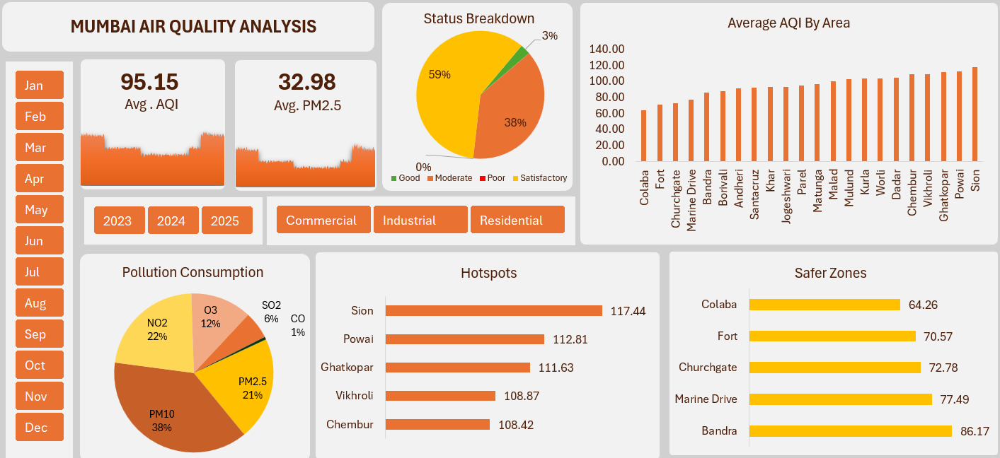

# Mumbai Air Quality Dashboard  

## 📌 Project Description  
The **Mumbai Air Quality Dashboard** is an interactive data visualization project that analyzes rising urban air pollution in Mumbai. With rapid industrial growth, heavy traffic, and constant construction, Mumbai faces worsening air quality that poses serious health and environmental risks.  

This dashboard transforms complex air quality data into clear, actionable insights. It highlights pollution hotspots, seasonal patterns, and the impact of human activity on air quality. The tool is designed to help policymakers, researchers, and citizens better understand pollution trends and take informed actions toward cleaner air.  

---

## 🎯 Objectives  
- **Provide Clarity:** Simplify air quality metrics for both policymakers and the general public.  
- **Track Pollution Hotspots:** Identify the most polluted and least polluted areas in Mumbai.  
- **Support Policy Decisions:** Deliver data-driven insights for urban planning, traffic management, and industrial regulations.  
- **Raise Awareness:** Empower citizens to make informed choices and advocate for cleaner air.  

---

## 📊 Dataset Description  
The dataset contains **daily air quality measurements** across multiple locations in Mumbai.  

### Dataset Columns:  
- **Date** – Daily record of observation.  
- **Location** – Specific monitoring zone (e.g., Sion, Colaba, Powai).  
- **Area Type** – Categorized as *Residential, Commercial, or Industrial*.  
- **AQI (Air Quality Index)** – A single score that combines pollutant effects.  
- **AQI Category** – Health-related categories (Good, Satisfactory, Moderate, Poor, etc.).  
- **Pollutants Measured:**  
  - **PM2.5** – Tiny particles from vehicles, burning, industries.  
  - **PM10** – Larger dust particles from roads, construction.  
  - **NO₂** – Gas from vehicles and fuel burning.  
  - **O₃** – Ground-level ozone, main part of smog.  
  - **SO₂** – From coal/diesel burning, leads to acid rain.  
  - **CO** – Carbon monoxide, harmful for heart and brain.  

---

## 📈 Dashboard Features  
- **Overall AQI & PM2.5 Tiles** – Quick snapshot of Mumbai’s average air quality.  
- **Air Quality Status Breakdown** – Pie chart of Good/Satisfactory/Moderate/Poor days.  
- **Pollutant Mix Analysis** – Identifies which pollutants dominate.  
- **Location Comparison** – Highlights hotspots (Sion, Powai) vs. cleaner zones (Colaba, Fort).  
- **Area Type Analysis** – Compares residential, commercial, and industrial pollution levels.  
- **Seasonal Trends** – Monthly & yearly variations (e.g., November worst, monsoon months cleanest).  

---

## 🚀 How This Helps  
- **For Policymakers:** Provides a unified view to enforce stricter rules, control construction dust, and promote sustainable practices.  
- **For Citizens:** Encourages lifestyle changes like carpooling, avoiding waste burning, and checking AQI before outdoor activities.  

---

## 📌 Future Enhancements  
- Real-time AQI tracking and live updates.  
- Forecasting models for upcoming pollution levels.  
- Integration with health impact data for deeper insights.  

--- 

## 📐 Formula & Transformations  

This dashboard makes use of **Power Query transformations** and calculated fields to enrich the dataset.  

### 🔹 Calendar Table (Power Query)  
A separate **Calendar Table** was created using the `List.Dates` function:  

```m
= List.Dates(StartDate, NumberOfDays, #duration(1,0,0,0))
```
### AQI Category 
This has been derived from using **IF Formula** based on AQI score:
```m
= IF(AQI <= 50, "Good", 
    IF(AQI <= 100, "Satisfactory", 
    IF(AQI <= 200, "Moderate", 
    IF(AQI <= 300, "Poor", 
    IF(AQI <= 400, "Very Poor", "Severe")))))
```

## Dashboard Preview


